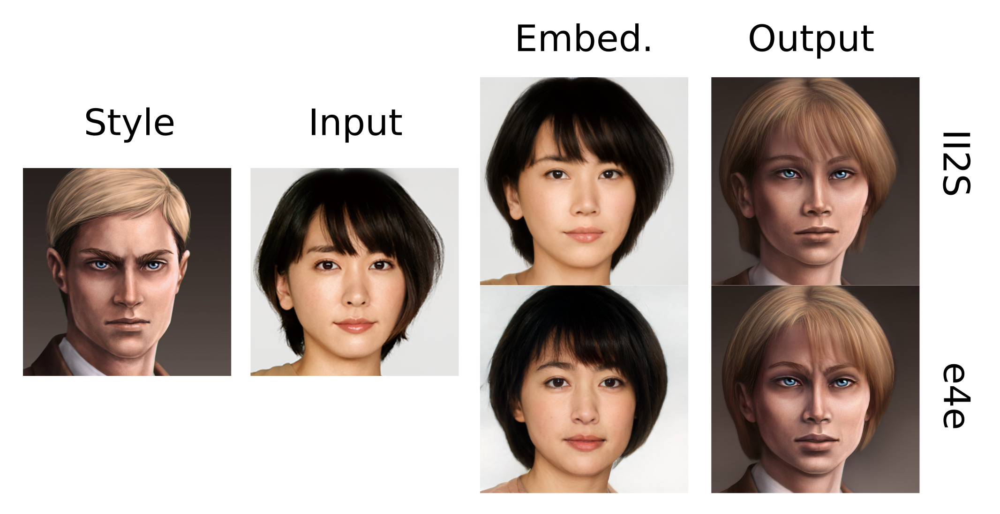
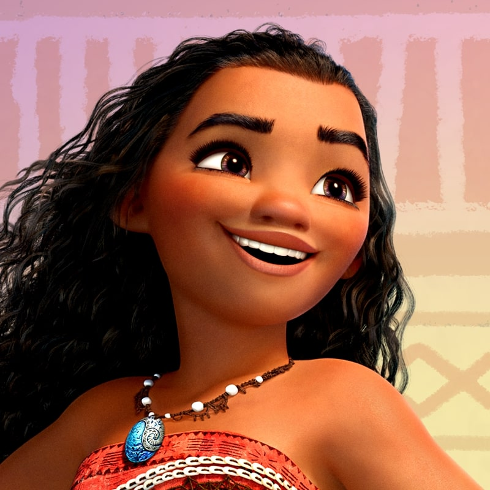
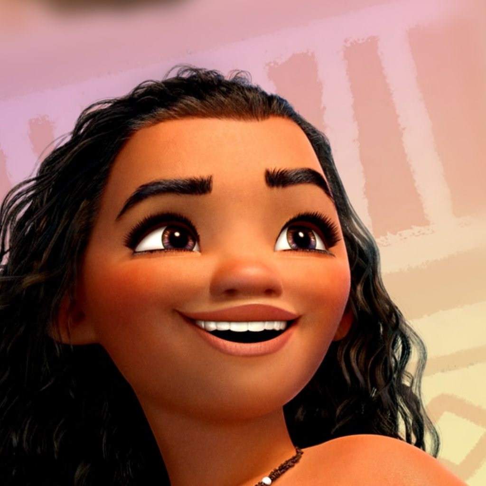

# Mind the Gap - Official PyTorch Implementation

[Peihao Zhu](https://github.com/ZPdesu),
[Rameen Abdal](https://github.com/RameenAbdal),
[John Femiani](https://scholar.google.com/citations?user=rS1xJIIAAAAJ&hl=en),
[Peter Wonka](http://peterwonka.net/)<br/>


[](https://arxiv.org/abs/2110.08398)
[](https://colab.research.google.com/github/ZPdesu/MindTheGap/blob/main/MTG_playground.ipynb)
[](https://recorder-v3.slideslive.com/?share=63876&s=521f3835-b85b-4c4a-8452-0281f9553ad8)
[](https://zpdesu.github.io/MindTheGap)


> **Abstract:** We present a new method for one shot domain adaptation. The input to our method is trained GAN that can produce images in domain A and a single reference image I_B from domain B. The proposed algorithm can translate any output of the trained GAN from domain A to domain B. There are two main advantages of our method compared to the current state of the art: First, our solution achieves higher visual quality, e.g. by noticeably reducing overfitting. Second, our solution allows for more degrees of freedom to control the domain gap, i.e. what aspects of image I_B are used to define the domain B. Technically, we realize the new method by building on a pre-trained StyleGAN generator as GAN and a pre-trained CLIP model for representing the domain gap. We propose several new regularizers for controlling the domain gap to optimize the weights of the pre-trained StyleGAN generator to output images in domain B instead of domain A. The regularizers prevent the optimization from taking on too many attributes of the single reference image. Our results show significant visual improvements over the state of the art as well as multiple applications that highlight improved control.


<p align="center">

</p>

## Description
Official Pytorch Implementation of "<a href="https://arxiv.org/abs/2110.08398"> Mind the Gap: Domain Gap Control for Single Shot Domain Adaptation for Generative Adversarial Networks</a>"


## Google Colab 
[](https://colab.research.google.com/github/ZPdesu/MindTheGap/blob/main/MTG_playground.ipynb)

We set up a [Colab Notebook](https://colab.research.google.com/github/ZPdesu/MindTheGap/blob/main/MTG_playground.ipynb) so you can play with it yourself :) Everything to get started is in it!

## Getting Started
### Prerequisites
- Linux or macOS
- NVIDIA GPU + CUDA CuDNN
- Python 3

### Installation
- Clone the repository:
``` 
git clone https://github.com/ZPdesu/MindTheGap.git
cd MindTheGap
```
- Dependencies:
We recommend running this repository using [Anaconda](https://docs.anaconda.com/anaconda/install/).
All dependencies for defining the environment are provided in `./environment/environment.yml`.
```
conda env create -f environment/environment.yml
```

### Pretrained Models

If the automatic download doesn't work, please download the pre-trained models from [Google Drive](https://drive.google.com/drive/folders/1v9nSxN2306XK3GzrJYBEeyN1htxXyvY8?usp=sharing).

| Model | Description
| :--- | :----------
|[FFHQ](https://drive.google.com/uc?id=1AT6bNR2ppK8f2ETL_evT27f3R_oyWNHS) | StyleGAN model pretrained on [FFHQ](https://github.com/NVlabs/ffhq-dataset) with 1024x1024 output resolution.
|[e4e_ffhq_encode](https://drive.google.com/uc?id=1O8ipkyMYHwCRmuaZBaO-KYZ9FYuH8Xnc) | FFHQ e4e encoder.
|[titan_erwin](https://drive.google.com/uc?id=1AvSrWkIxgoxXtjPuogKiP45BkKJvFQbI) |  StyleGAN model finetuned on titan_erwin.png.
|[titan_armin](https://drive.google.com/uc?id=1o9yhTmW8voeCi6dNrOY3sSVQqMawftRB) | StyleGAN model finetuned on titan_armin.png.
|[titan_historia](https://drive.google.com/uc?id=1MqMmdcCGXutoDV8wxP31K2iyvA4SgJx7) | StyleGAN model finetuned on titan_historia.png
|[pocahontas](https://drive.google.com/uc?id=1jRcWh7lQ-28abiSOVBVUi_iBDGPj7Esl) | StyleGAN model finetuned on pocahontas.png
|[moana](https://drive.google.com/uc?id=19kjijHa_G2B3UrNGHXYVe5izaNdi8ABr) | StyleGAN model finetuned on moana.png
|[doc_brown](https://drive.google.com/uc?id=1fQJYUE9a9DSoRupOxllslA-dIm-8-D72) | StyleGAN model finetuned on doc_brown.png
|[brave](https://drive.google.com/uc?id=1wD3xoGgrmbN74npUAlrmkk97_DXF6NWR) | StyleGAN model finetuned on brave.png
|[sketch](https://drive.google.com/uc?id=1YbFyukh6n9l6UFtsqOESbhwGH7BupJtb) | StyleGAN model finetuned on sketch.png
|[jojo](https://drive.google.com/uc?id=1VLLmh7f-vcS2MB3CXET1lFRC-_Sq-p8J) | StyleGAN model finetuned on jojo.png
|[detroit](https://drive.google.com/uc?id=1cYSX9oLkhv6vosIAKnEQZoDFQS5siT-u) | StyleGAN model finetuned on detroit.png
|[picasso](https://drive.google.com/uc?id=1C7pCKIFdqFFrK9diFZKGLXrYlmrPP2Ui) | StyleGAN model finetuned on picasso.png
|[anastasia](https://drive.google.com/uc?id=1iXxaxKG0EJ_C1Jr5QrBogq9yvMzyhcth) | StyleGAN model finetuned on anastasia.png
|[room_girl](https://drive.google.com/uc?id=16F1oCrv8UNnhlqFFUwJy49OpW5d-kA-m) | StyleGAN model finetuned on room_girl.png
|[speed_paint](https://drive.google.com/uc?id=1uB2uQnAF8pghXNlTnGRTduiwpAtcDiqo) | StyleGAN model finetuned on speed_paint.png
|[digital_painting_jing](https://drive.google.com/uc?id=168bfp7FvN_VF1pOT7uEYzhtj2oFGIsQ_) | StyleGAN model finetuned on digital_painting_jing.png
|[mermaid](https://drive.google.com/uc?id=1LO3UdMHPKfwjaaxgVgBbLquei8n8q5P8) | StyleGAN model finetuned on mermaid.png
|[zbrush_girl](https://drive.google.com/uc?id=1YPQSDW-_utOEu5A9nbq2832jTTJK2ECb) | StyleGAN model finetuned on zbrush_girl.png
|[joker](https://drive.google.com/uc?id=1Ptv-EjYAKngxpf9lY5cpypAmyoX863Nh) | StyleGAN model finetuned on joker.png


By default, we assume that all models are downloaded and saved to the directory `pretrained_models`.


## Inference
Transfer the pretrained style onto a given image:

```
python inference.py --input_img Yui.jpg --style_img titan_erwin.png --embedding_method II2S
```

Put the unprocessed input image (e.g. Yui.jpg) to `./face_images/Unaligned`. After the code runs, the aligned input image will be saved in  `./face_images/Aligned`, and the corresponding embedding latent code will be saved in `./inversions/II2S`. Users can find output results in `./output/inference`.


To speed up runtime, users can choose to use e4e embeddings at inference time.
```
python inference.py --input_img Yui.jpg --style_img titan_erwin.png --embedding_method e4e
```
**Remark**: Although using e4e can save inference time, its embedding results are sometimes very different from the input image.
<p align="left">

</p>


## Generation
Generate random face images using pretrained styles. (Results are saved in the `./output/generate` folder):
```
python generate.py --style_img titan_erwin.png --n_sample 5 --truc 0.5
```


<p align="left">


</p>


## Train on your own style image
Put your own style image in the `./style_images/Unaligned` folder and run

```
python train.py --style_img moana.jpg
```
The finetuned generator will be saved in the  `./output/train` folder. More training options can be found in `./options/MTG_options.py`.
For example, specify loss weights and training iterations.

```
python train.py --style_img moana.jpg --clip_across_lambda 1 --ref_clip_lambda 30 --l2_lambda 10 --lpips_lambda 10 --clip_within_lambda 0.5 --iter 600
```

<p align="left">
 
</p>

Iteration: 0
<p align="left">


</p>

Iteration: 600
<p align="left">


</p>


## BibTeX

```
@misc{zhu2021mind,
    title={Mind the Gap: Domain Gap Control for Single Shot Domain Adaptation for Generative Adversarial Networks},
    author={Peihao Zhu and Rameen Abdal and John Femiani and Peter Wonka},
    year={2021},
    eprint={2110.08398},
    archivePrefix={arXiv},
    primaryClass={cs.CV}
}
```
## Acknowledgments
This code borrows from [StyleGAN2 by rosalinity](https://github.com/rosinality/stylegan2-pytorch) and [II2S](https://github.com/ZPdesu/II2S). Some snippets of colab code from [StyleGAN-NADA](https://github.com/rinongal/StyleGAN-nada) and [JoJoGAN](https://github.com/mchong6/JoJoGAN)
